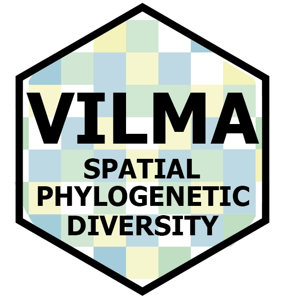

<!-- badges: start -->
[](https://github.com/oleon12/vilma/actions/workflows/R-CMD-check.yaml)
[](LICENSE)
[](https://github.com/oleon12/vilma/releases)
[](https://github.com/oleon12/vilma/stargazers)
<!-- badges: end -->


# vilma: an R package for spatial phylogenetic diversity analyses with a Shiny interface. 

---

## About vilma (1.0.0)

`vilma`is an open-source R package and Shiny application designed to transform species occurrence records into reproducible maps of evolutionary biodiversity across geographic landscapes. It integrates occurrence data, phylogenetic trees, spatial grids, diversity indices, null models, and visualization tools to help users move from raw biodiversity records to interpretable ecological and conservation insights.

Vilma provides a complete and reproducible workflow to:

* Convert species occurrence records into spatial distribution grids.
* Compute alpha phylogenetic diversity indices such as Faith’s PD, MPD, MNTD, PE, Rao’s Q, NRI, and NTI.
* Estimate beta phylogenetic diversity metrics, including PhyloSor, UniFrac, Phylobeta weighted and unweighted, betaMPD, and betaMNTD.
* Implement and test spatial null models at both regional and local cell-based levels to assess whether observed spatial patterns deviate from random expectations.
* Visualize and export spatially explicit outputs as static maps, interactive maps, tables, and raster layers for further ecological, evolutionary, and conservation analyses..

---

Developed as part of an ongoing research project at the **Department of Mammalogy, American Museum of Natural History**, and the **Department of Earth and Environmental Sciences, Rutgers University–Newark**, `vilma` provides a flexible framework to investigate phylogenetic structure, endemism, and connectivity in ecological and evolutionary studies.

---

<br>

<div align="center">
  
  <p>
    <em>Created in loving memory of <strong>Vilma Alvarado</strong>, whose kindness and love continue to inspire this work.</em>
  </p>
</div>

<br>

---

### Installation 

**Development version (recommended)**
Requires `devtools`:

```r
install.packages("devtools")
devtools::install_github("oleon12/vilma", build_vignettes = FALSE)
```
<br>

### Shiny App

Vilma can be used through a <b>Shiny interface</b>. This interface was built for users with little experience in R or programming in general. However, the user must understand all parameters and indices to perform an appropriate analysis for their research question. Therefore, we always advise users to keep in mind the principle of <b>GIGO (Garbage In, Garbage Out)</b>. Running the app is very easy: simply open an <i>R</i> or <i>RStudio</i> session and run the following lines of code.

```r
library(vilma)

# Launch the analysis app
run.vilma.app()
```
<br>

Vilma is intended to be a pipeline where the user starts by creating a raster file and then uses a phylogeny to calculate &alpha;-diversity, &alpha;-null models, and &beta;-diversity. However, the user can skip some steps and run only the desired analyses. For the Shiny app, please note that the phylogeny (of class <i>phylo</i>) must be uploaded on the &alpha;-diversity page.

<br>

### Interactive view

Although the Shiny app is the most remarkable feature for interactivity, Vilma also provides interactive map visualizations. For every analysis (raster,  &alpha;-diversity, &alpha;-null models, and &beta;), results can be viewed using the <i>view.vilma()</i> function. This function displays a Leaflet map with raster layers. You can toggle between layers using the Layer Control button . Furthermore, if you move the mouse over any pixel, a pop-up window will appear above the Layer Control button showing the value for that specific pixel.

<br>
