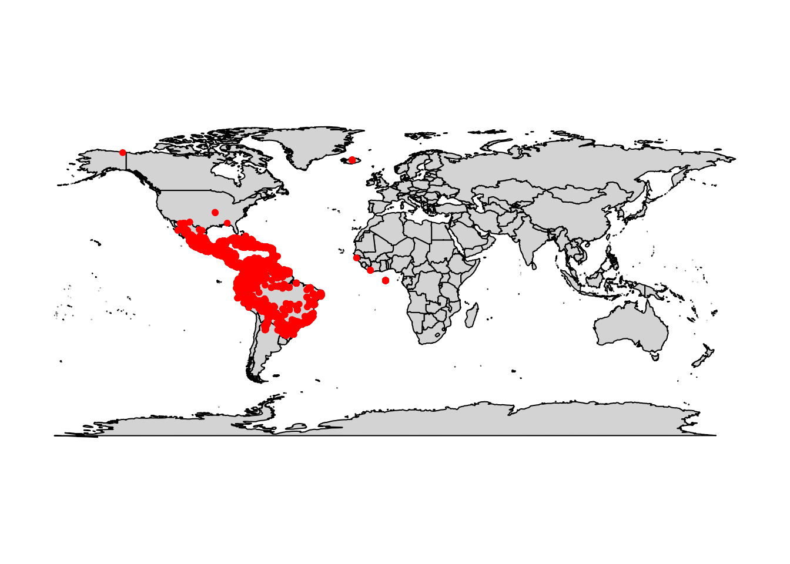
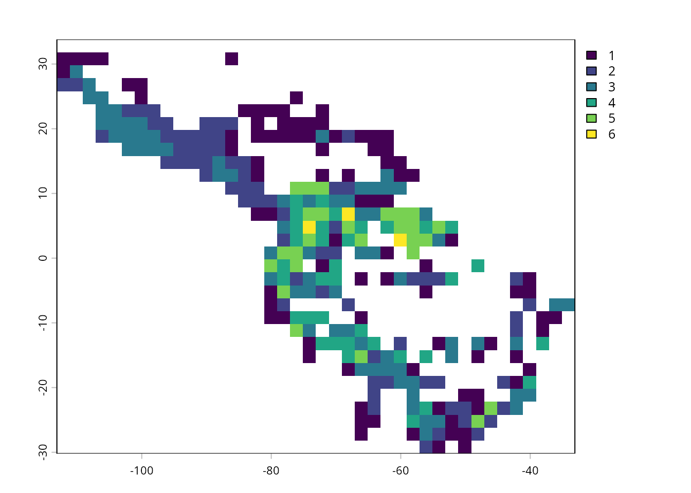
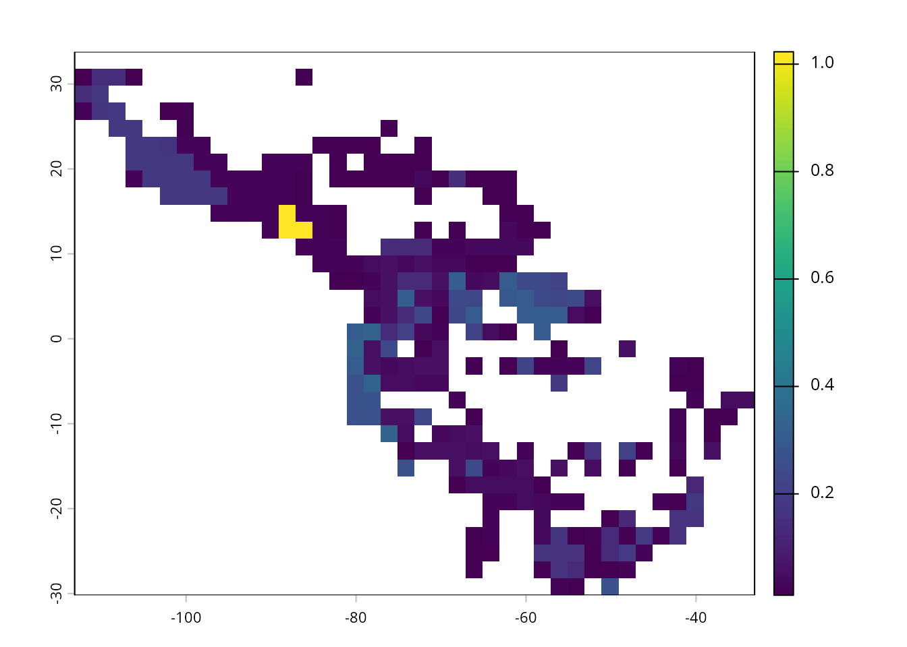

# Using vilma with GBIF data

  
[Omar Daniel Leon-Alvarado](https://leon-alvarado.weebly.com/)¹²; [J.
Angel Soto-Centeno](https://www.mormoops.com/)²

¹ Department of Earth and Environmental Science, Rutgers
University-Newark, NJ, USA.

² Department of Mammalogy, American Museum of Natural History, New York
City, NY, USA.  

------------------------------------------------------------------------

  
One of the goals of `vilma` is to make spatial analyses easier to
perform. For this reason, the geographic input format is simple and
straightforward to obtain. **The Global Biodiversity Information
Facility** (GBIF) is a globally recognized platform and one of the most
important biodiversity databases used in ecological and evolutionary
studies. From this resource, you can easily download geographic
information for any species, collected from multiple sources such as
museums or citizen-science platforms like iNaturalist. You may either
download data directly from the GBIF website or obtain it using R. In
this tutorial, you will see a small example showing how to use Vilma
with GBIF data.

------------------------------------------------------------------------

### 1. Data from GBIF

  

In this example, you will work with one of the most common and
well-known genera of fruit-eating bats: *Artibeus*. Species in this
genus are large, widespread, and common across many landscapes,
including densely populated cities. They occur from Mexico to Argentina,
and therefore have abundant spatial and phylogenetic data available. For
a spatial phylogenetic diversity analysis, you will need two things:
**occurrence records** and a **phylogenetic tree**.

Let’s start with the occurrence data. You can obtain GBIF records either
through the GBIF website or directly from R. Depending on the number of
species and records you wish to analyze, one method may be more
convenient than the other. In this example, you will work with data
previously downloaded from GBIF, but you will also learn how to download
it directly in R.

To retrieve data from GBIF in R, you will need the
[rgbif](https://docs.ropensci.org/rgbif/articles/rgbif.html) package,
which handles communication between R and the GBIF API. There are two
main functions to download data: `occ_data` and `occ_search`. Here, you
will use `occ_search`. First, you will download data for a single
species and extract the three necessary columns: species, longitude, and
latitude. Additional parameters in `occ_search` help filter the results;
in this example, only records with coordinates will be downloaded
(`hasCoordinate = TRUE`).

Once the data is downloaded, you will apply a simple filter to retain
only records where the basis of record is `"PRESERVED_SPECIMEN"`. This
helps reduce issues with misidentifications by focusing on specimens
curated in museum collections. Although not all museum specimens are
perfectly identified, this approach provides a more reliable subset of
data.

  

``` r
# Call the library
library(rgbif)

# Download the data
data_gbif <- occ_search(scientificName = "Artibeus lituratus", hasCoordinate = TRUE, limit = 200000)$data

# Filter by "PRESERVED_SPECIMEN"
data_gbif <- data_gbif[which(data_gbif$basisOfRecord == "PRESERVED_SPECIMEN"),]

# Extract the required columns
data_gbif <- data.frame(Species = as.factor(data_gbif$species),
                        Lon = as.numeric(data_gbif$decimalLongitude),
                        Lat = as.numeric(data_gbif$decimalLatitude))
```

  
Great! Now you have the data for the most widespread species in this
genus. However, you still need occurrence records for the remaining
species. To do this efficiently, you will use a loop to retrieve the
data for all other *Artibeus* species.

First, create a list object containing the names of the additional
species. The loop will then repeat the same steps used previously:
download the data for each species using `occ_search`, filter the
results to keep only `"PRESERVED_SPECIMEN"` records, extract the
required columns, and finally append each temporary data frame
(`tmp_gbif`) to the main data frame (`data_gbif`) using `rbind`.

  

``` r
# Create species list vector
sp_list <- c("Artibeus concolor", "Artibeus fimbriatus", "Artibeus fraterculus", "Artibeus hirsutus",
             "Artibeus inopinatus", "Artibeus jamaicensis", "Artibeus obscurus", "Artibeus planirostris")

# Loop
for(i in sp_list){
  
  tmp_gbif <- occ_search(scientificName = i, hasCoordinate = TRUE, limit = 200000)$data
  tmp_gbif <- tmp_gbif[which(tmp_gbif$basisOfRecord == "PRESERVED_SPECIMEN"),]
  
  
  tmp_gbif <- data.frame(Species = as.factor(tmp_gbif$species),
                         Lon = as.numeric(tmp_gbif$decimalLongitude),
                        Lat = as.numeric(tmp_gbif$decimalLatitude))
  
  data_gbif <- rbind(data_gbif, tmp_gbif) # Join data frames
}

# Save the results
write.csv(data_gbif, "../inst/extdata/Artibeus_occ.csv", row.names = F, quote = F)

head(data_gbif, 5L)
```

    #>              Species       Lon      Lat
    #> 1 Artibeus lituratus -78.54758 -3.61688
    #> 2 Artibeus lituratus -78.54758 -3.61688
    #> 3 Artibeus lituratus -78.62413 -3.67235
    #> 4 Artibeus lituratus -78.62413 -3.67235
    #> 5 Artibeus lituratus -78.53922 -3.58929

  

If you prefer to use the data downloaded directly from the GBIF website,
you only need to read it into R with the `read.delim` function and
extract the relevant columns. Although GBIF labels the file as a .csv,
the fields are always tab-separated, not comma-separated. For this
reason, you should use `read.delim`. If you use the base function
`read.csv`, the file will not be parsed correctly, and you may encounter
multiple column-format issues.

  

``` r
data_gbif <- read.delim("0011971-251120083545085.csv") # CSV from GBIF

data_gbif <- data.frame(Species = data_gbif$species,
                     Lon = as.numeric(data_gbif$decimalLongitude),
                     Lat = as.numeric(data_gbif$decimalLatitude))
```

  

Now, an important reminder: GBIF data often contain errors and
inconsistencies. Coordinates may have incorrect signs (negative values
reported as positive or vice versa), some records appear as 0, 0, and
GPS inaccuracies may place points far from their true locations. In this
example, the only filter applied was to restrict the dataset to museum
specimens, but in real analyses you must clean your data carefully
before using it — not only for Vilma, but for any package, model, or
algorithm. Proper data cleaning is essential to avoid bias,
misinterpretation, and incorrect spatial or phylogenetic results.

For this example, you can quickly inspect the points using the `map`
function and visualize the distribution of the occurrences. As you can
see, many points fall outside the natural range of these species,
appearing in places such as Africa, Iceland, and Alaska.

  

``` r
library(maps)

map(database = "world", fill = TRUE, col = "lightgray", bg = "white")
points(data_gbif$Lon, data_gbif$Lat, pch = 20, col = "red")
```

  

In this case, to keep the example simple (although this is not the best
option in real analyses), you will remove the points that fall outside
the natural range of the species. The first step is to create the
geographic limits, similar to a bounding box, restricting the X and Y
coordinates to the area between the southern United States and
Argentina. Once these limits are defined, you can subset the dataset to
keep only the points that fall within this range.

Now that all points have been checked and are reasonably cleaned, you
can proceed to the next part of the analysis.

  

``` r
# Limits
xmin <- -119 # West limit
xmax <- -30 # East limit
ymin <- -35 # South limit
ymax <-  35 # North limit

# Filter
data_gbif <- subset(data_gbif,
                    Lon >= xmin & Lon <= xmax &
                    Lat  >= ymin & Lat  <= ymax)

# Filter
map(database = "world", fill = TRUE, col = "lightgray", bg = "white")
points(data_gbif$Lon, data_gbif$Lat, pch = 20, col = "red")
```

  

------------------------------------------------------------------------

### 2. Phylogenetic Tree

  
Next, you need a phylogenetic tree. Unfortunately, many studies today do
not publish their phylogenies in useful or reproducible formats such as
Newick or Nexus files, which can make obtaining a proper tree
challenging. Sometimes, the only available option is to manually
reconstruct a tree from a figure in the article.

To ensure accuracy in this tutorial, you will use a phylogenetic tree
obtained from [VertLife](https://vertlife.org/) – Phylogeny Subsets.
This NSF-funded project integrates multiple databases to generate
phylogenetic trees for any specified list of species. In this case, the
tree is generated specifically for the species of interest in the genus
*Artibeus*.

Now, you will read the tree using the `read.nexus` function from the ape
package and inspect its structure.

  

``` r
library(ape)
library(phytools)

artibeus_tree <- read.nexus("../inst/extdata/artibeus_tree.nex")

# or
# data(artibeus_tree)

length(artibeus_tree) # Check number of trees
#> [1] 5

plot(artibeus_tree)
```

  

------------------------------------------------------------------------

Now that you have all the necessary data, you must check that the
species names match between the occurrence dataset and the phylogenetic
tree. This step is essential not only for Vilma, but for any package or
method that computes phylogenetic diversity indices. If the names do not
match exactly, the analyses will fail or produce incorrect results.

  

``` r
intersect(unique(data_gbif$Species), artibeus_tree$tip.label) # Check the intersect, but value is 0 !
#> character(0)

unique(data_gbif$Species)
#>  [1] "Artibeus lituratus"    "Artibeus concolor"     "Artibeus fimbriatus"  
#>  [4] "Artibeus fraterculus"  "Artibeus hirsutus"     "Artibeus inopinatus"  
#>  [7] "Artibeus jamaicensis"  "Artibeus obscurus"     "Artibeus planirostris"
#> [10] "Artibeus amplus"
artibeus_tree$tip.label
#>  [1] "'Ariteus_flavescens'"    "'Artibeus_concolor'"    
#>  [3] "'Artibeus_inopinatus'"   "'Artibeus_hirsutus'"    
#>  [5] "'Artibeus_fraterculus'"  "'Artibeus_jamaicensis'" 
#>  [7] "'Artibeus_fimbriatus'"   "'Artibeus_lituratus'"   
#>  [9] "'Artibeus_obscurus'"     "'Artibeus_planirostris'"
#> [11] "'Artibeus_amplus'"
```

  

So, there is no match between the species names! This happens because
the genus and species epithet in the phylogenetic tree are separated by
an underscore (\_) instead of a space, and a “’” symbol. You can fix
this mismatch using the `gsub` function, which replaces one pattern with
another. This function is extremely useful in many situations, so it is
worth learning how it works. After correcting the names and running the
`intersect` function again, you will see that all species now match
correctly.

  

``` r
# New tip.label
artibeus_tree$tip.label <- gsub("_", " ", artibeus_tree$tip.label) # Replace "_" by " " in $tip.label
artibeus_tree$tip.label <- gsub("'", "", artibeus_tree$tip.label) # Replace "'" by "" in $tip.label

intersect(unique(data_gbif$Species), artibeus_tree$tip.label)
#>  [1] "Artibeus lituratus"    "Artibeus concolor"     "Artibeus fimbriatus"  
#>  [4] "Artibeus fraterculus"  "Artibeus hirsutus"     "Artibeus inopinatus"  
#>  [7] "Artibeus jamaicensis"  "Artibeus obscurus"     "Artibeus planirostris"
#> [10] "Artibeus amplus"
```

  

Note that there is one species in the phylogeny that is missing from the
distribution data: *Ariteus flavescens*. This is fine. This species is
the outgroup used to root the tree, so you do not need occurrence
records for it.

------------------------------------------------------------------------

### 3. The vilma.dist object

  

Now that you have both the occurrence data and the phylogenetic tree,
you can proceed to the next step: building the `vilma.dist` object. This
object is the foundation for all phylogenetic diversity analyses in
Vilma. To create it, you will use the `points_to_raster` function. This
function transforms the occurrence records into several spatial objects
and combines them into a single S4 `vilma.dist` object.

First, if you do not have the package installed, the easiest way to get
the latest version is through its [GitHub
repository](https://github.com/oleon12/vilma). To do this, you will need
the `devtools` package.

  

``` r
install.packages("devtools")

devtools::install_github("oleon12/vilma", build_vignettes = FALSE)
```

  

Now you can create the `vilma.dist` object. The `points_to_raster`
function generates a raster with species richness and abundance values
per pixel. The user also defines the pixel size; in this example, the
raster will have a resolution of 2 degrees. Once the `vilma.dist` object
is created, you can inspect the spatial information it contains using
the `print` function.

  

``` r
library(terra)
library(vilma)

raster_out <- points_to_raster(points = data_gbif, res = 2, crs = 4326)
print(raster_out)
#> 
#> vilma.dist Object Summary
#> -------------------------
#> 
#> Distribution Matrix:
#>   - Species: 10 unique taxa
#>   - Cells:   295 spatial units
#>   - Records: 43454 total observations
#> 
#> Species Abundance Summary:
#>   - Range:    114 - 19402 observations per species
#>   - Total:    43454 observations
#>   - Mean:     4345.4 +/- 6761.6 (SD) observations per species
```

  

You can also inspect all the components stored inside the `vilma.dist`
object. The first element is a `data frame` that contains every
occurrence record along with its corresponding raster cell. The object
also includes three raster files. The first one (**grid**) is an empty
raster with the predefined resolution, which will be used by the index
functions. The second one (**r.raster**) is the raster with species
richness values, and the third one (**ab.raster**) is the raster with
abundance values.

You can visualize any of these rasters using the `plot` function, or
generate an interactive map using `view.vilma`.

``` r
str(raster_out)
#> List of 4
#>  $ distribution:'data.frame':    43454 obs. of  4 variables:
#>   ..$ Sp  : chr [1:43454] "Artibeus lituratus" "Artibeus lituratus" "Artibeus lituratus" "Artibeus lituratus" ...
#>   ..$ Lon : num [1:43454] -78.5 -78.5 -78.6 -78.6 -78.5 ...
#>   ..$ Lat : num [1:43454] -3.62 -3.62 -3.67 -3.67 -3.59 ...
#>   ..$ Cell: num [1:43454] 738 738 738 738 738 738 738 621 621 498 ...
#>  $ grid        :S4 class 'SpatRaster' [package "terra"]
#>  $ r.raster    :S4 class 'SpatRaster' [package "terra"]
#>  $ ab.raster   :S4 class 'SpatRaster' [package "terra"]
#>  - attr(*, "class")= chr "vilma.dist"
```

``` r
plot(raster_out$r.raster)
```



------------------------------------------------------------------------

### 4. Phylogenetic Diversity Indices

  

Now that you have the `vilma.dist` object, you are ready to calculate a
phylogenetic diversity index. In this example, you will compute
**Phylogenetic Endemism (PE)**. This metric measures the amount of
unique evolutionary history restricted to each cell by weighting branch
lengths according to the geographic range of the lineages they
represent. PE highlights areas that contain evolutionarily distinct or
range-restricted lineages and is commonly used to detect centers of
paleo- or neo-endemism.

Before continuing, you should be aware that this index uses **pairwise
distance matrices**, which means you need at least two species per
community, or in this case, per pixel or cell. However, as you saw in
the previous plot, many cells contain only a **single species**. This is
an edge case and can be problematic.

In most packages, these cells are simply removed and their values
returned as NA, but `vilma` offers three different options to handle
this situation and still include evolutionary information for
single-species cells. The first option is `root`, which calculates the
distance from the species’ tip to the root of the tree; this distance is
then used as the MPD value for that cell. This approach works well for
small trees but can become overly sensitive or inflated when using very
large phylogenies. The second option is `node`, which calculates the
distance from the tip to the most recent common ancestor (MRCA); this
branch length is used as the MPD value for that cell. This method is
often more stable for large trees.

Finally, if you prefer, you can remove single-species cells entirely by
using the `exclude` method, which sets these cells to NA. For this
example, you will use the root method, as the tree is small.

  

``` r
pe_out <- pe.calc(tree = artibeus_tree, dist = raster_out,faith.method = "root")
print(pe_out)
#> 
#> vilma.pd Object Summary
#> -------------------------
#> 
#> Distribution Matrix:
#>   - Species: 10 unique taxa
#>   - Cells:   295 spatial units
#>   - Records: 43454 total observations
#> 
#> Species Abundance Summary:
#>   - Range:    114 - 19402 observations per species
#>   - Total:    43454 observations
#>   - Mean:     4345.4 +/- 6761.6 (SD) observations per species
#> 
#> SR Summary: 
#>   - Range:    1.00 - 6.00 
#>   - Mean:     2.48 +/- 1.32 (SD) 
#> 
#> PD Summary: 
#>   - Range:    0.01 - 1.02 
#>   - Mean:     0.09 +/- 0.13 (SD) 
#> 
#> RPE Summary: 
#>   - Range:    0.00 - 0.08 
#>   - Mean:     0.01 +/- 0.01 (SD) 
#> 
#>   - Index: pe.calc
```

``` r
#view.vilma(pd_out)
plot(pe_out$rasters$pd.raster)
```



``` r
view.vilma(pe_out)
```

  

That’s it! You have now completed a spatial phylogenetic diversity
analysis. From here, you can explore your results, try other indices,
save outputs using the `write.vilma` functions, run null models, and
even calculate beta-diversity indices. Finally, let’s examine the
structure of the output object, which in this case is a `vilma.pd`
object.

The `vilma.pd` object is generated by all alpha-diversity functions. It
contains several elements, including:

- **distribution:** a data frame identical to the one in the vilma.dist
  object, showing every occurrence and the cell it belongs to.
- **grid:** an empty raster with the original resolution defined in the
  vilma.dist object.
- **pd.table:** a data frame summarizing the richness, abundance, and
  phylogenetic diversity values for each cell.
- **rasters:** a list containing the richness, abundance, and
  phylogenetic diversity rasters.
- **index.info:** a vector storing information about the index used.

  

``` r
 str(pe_out)
#> List of 5
#>  $ distribution:'data.frame':    43454 obs. of  4 variables:
#>   ..$ Sp  : chr [1:43454] "Artibeus lituratus" "Artibeus lituratus" "Artibeus lituratus" "Artibeus lituratus" ...
#>   ..$ Lon : num [1:43454] -78.5 -78.5 -78.6 -78.6 -78.5 ...
#>   ..$ Lat : num [1:43454] -3.62 -3.62 -3.67 -3.67 -3.59 ...
#>   ..$ Cell: num [1:43454] 738 738 738 738 738 738 738 621 621 498 ...
#>  $ grid        :S4 class 'SpatRaster' [package "terra"]
#>  $ pd.table    :'data.frame':    295 obs. of  4 variables:
#>   ..$ Cell: chr [1:295] "41" "42" "43" "44" ...
#>   ..$ SR  : num [1:295] 1 1 1 1 1 1 3 2 2 3 ...
#>   ..$ PD  : num [1:295] 0.0154 0.1487 0.1487 0.0154 0.0154 ...
#>   ..$ RPE : num [1:295] 0.00293 0.02834 0.02834 0.00293 0.00293 ...
#>  $ rasters     :List of 3
#>   ..$ ab.raster:S4 class 'SpatRaster' [package "terra"]
#>   ..$ r.raster :S4 class 'SpatRaster' [package "terra"]
#>   ..$ pd.raster:S4 class 'SpatRaster' [package "terra"]
#>  $ index       : chr "pe.calc"
#>  - attr(*, "class")= chr "vilma.pd"
```

  

### 5. Conclusion

In this tutorial, you learned how to use `vilma` with occurrence data
obtained from GBIF. You first downloaded or read species occurrence
records, selected the columns required by `vilma`, and applied basic
filters to reduce common spatial errors. You also learned the importance
of checking species names between the occurrence data and the
phylogenetic tree, since exact name matching is required for
phylogenetic diversity analyses.

After preparing the data, you created a `vilma.dist` object using
`points_to_raster`, inspected its structure, and used it to calculate
Phylogenetic Endemism. This example showed how vilma transforms
occurrence points into raster-based inputs and then uses those spatial
objects together with a phylogeny to estimate phylogenetic diversity
patterns.

Overall, this tutorial provides a basic workflow for moving from raw
GBIF records to spatial phylogenetic diversity outputs in vilma. From
this point, you can apply additional data-cleaning steps, test other
alpha or beta phylogenetic diversity indices, visualize the results, and
export the outputs for further ecological, evolutionary, or conservation
analyses.
