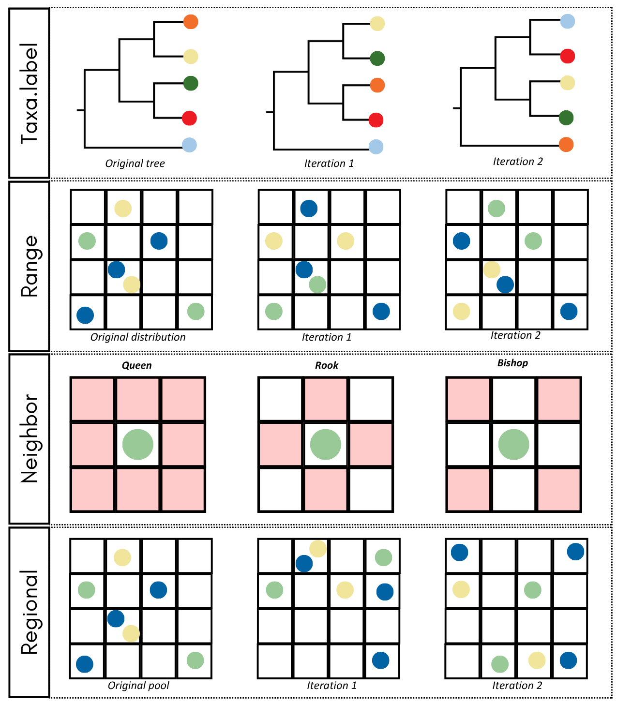

```{r setup, include=FALSE}
knitr::opts_chunk$set(
  collapse = TRUE,
  comment = "#>",
  warning = FALSE,
  message = FALSE
)

# By default, do not run optional spatial maps or heavy calculations.
# This keeps R CMD check stable across machines.
run_terra <- identical(Sys.getenv("VILMA_RUN_MAPS"), "true")
run_leaflet <- identical(Sys.getenv("VILMA_RUN_MAPS"), "true")
run_heavy <- identical(Sys.getenv("VILMA_RUN_HEAVY"), "true")
```

<br>
[Omar Daniel Leon-Alvarado](https://leon-alvarado.weebly.com/)¹²; [J. Angel Soto-Centeno](https://www.mormoops.com/)²

¹ Department of Earth and Environmental Science, Rutgers University-Newark, NJ, USA.

² Department of Mammalogy, American Museum of Natural History, New York City, NY, USA.
<br>

---

<br>

Null models are widely used to evaluate whether observed ecological or phylogenetic patterns could arise by chance. They work by generating randomized versions of the community while preserving specific properties—such as richness, species frequencies, or spatial structure—so that deviations between the observed and randomized values can be interpreted as evidence for clustering, overdispersion, or other non-random processes.

In `vilma`, null models are explicitly designed for spatial phylogenetic analyses. Species identities or spatial distributions are randomized according to four sampling schemes (`taxa.label`, `range`, `neighbor`, and `regional`), each preserving different aspects of the original data. These randomizations allow you to compute standardized **effect sizes** (SES) and **p-values** for any alpha-diversity index, helping you evaluate whether phylogenetic diversity within each cell or across the landscape is greater or lower than expected under a given ecological or biogeographic constraint.

<br>

<figure style="text-align: center;">
  
  <figcaption>Available null models in vilma</figcaption>
</figure>

---

### 1. Data
<br>
For this example, you will evaluate the spatial phylogenetic patterns of several <b>terrestrial carnivores</b> from <b>South Africa</b>. First, you will load all the required data for this exercise. The occurrence records were retrieved from [<b>GBIF</b>](https://doi.org/10.15468/dl.28qzb7), using a simple filter to remove entries without coordinates and to exclude marine mammals (Otariidae and Phocidae). However, as you will see, there is a small issue in the data—a very common one—that you will fix in the next steps.

This time, you are gonna read the CSV file, but you will transform it into a spatila object. This is becasue you will need to fix some points, and work with spatial objects is more easy than matrices itself. Also, you gonna read the South Africa's boundaries, which gonna help you to see how accurate the points are, and eventually, fix some mistakes.

<br>
```{r, message=FALSE, warning=FALSE}
# Call libraries
library(sf)
library(terra)
library(dplyr)

# Read Sout Africa polygon
sa_pol <- read_sf("../inst/extdata/South_Africa.gpkg")

# or
# data(sa_pol)

# Reada points
data_sa <- read.delim("../inst/extdata/Carnivora_SA.csv")

# or
# data(data_pol)

# Extract columns
data_sa <- data.frame(Specie = data_sa$species,
                      Lon = data_sa$decimalLongitude,
                      Lat = data_sa$decimalLatitude)

# Transform points into a spatal object
data_sa <- data_sa %>% st_as_sf(coords = c("Lon","Lat"), crs = 4326)

# Match the projection between the polygon and the points
data_sa <- st_transform(data_sa, st_crs(sa_pol))
```
<br>

Now, let’s check whether all occurrences fall within South Africa or if some points lie outside the country. To do this, you will use the `intersect` function and split the data into two subsets: <b><i>occ_inside</b></i> and <b><i>occ_outside</b></i>. Then, you will plot the results using the `tmap` package. This package is very useful for creating high-quality, publication-ready maps with relatively little code, offering a visual style comparable to `ggplot2`.

<br>
```{r split-inside-outside-points-null, warning=FALSE, message=FALSE}
# Extract the first column from the st_intersects result.
# TRUE = inside the polygon; FALSE = outside the polygon.
occ_intersect <- st_intersects(data_sa, st_union(sa_pol), sparse = FALSE)[, 1]

# Keep spatial objects as sf objects
occ_inside_sf <- data_sa[occ_intersect, ]
occ_outside_sf <- data_sa[!occ_intersect, ]
```

```{r plot-inside-outside-points-null, warning=FALSE, message=FALSE, fig.align='center', fig.width=7, fig.height=5, eval=run_terra}
library(tmap)

tm_shape(sa_pol) +
  tm_polygons() +
tm_shape(occ_inside_sf) +
  tm_dots() +
tm_shape(occ_outside_sf) +
  tm_dots(fill = "red")
```
<br>

In the plot, you can see a common issue with GBIF data: all of the points that fall outside South Africa lie very close to the country’s border. This often happens because GPS devices, calibration errors, signal drift, and other factors can shift coordinates by several meters. At this stage, you have two options: Remove these points or move them inside the country boundary. In this example, you will adjust the points. To make the correction as accurate and unbiased as possible, you will shift each point to the nearest location within the country’s border.

First, you will create a line between each point and the country border using `st_nearest_points`. This line represents the shortest distance between the occurrence and the polygon boundary. Then, using `st_cast`, you will convert each line into two points: the starting point (the original occurrence) and the ending point (the nearest location on the border). Finally, by using a grouping index, you will extract the second point of each line—the endpoint—which corresponds to the corrected coordinate located inside the country boundaries.

<br>
```{r fix-outside-points-data-null, warning=FALSE, message=FALSE}
# Create lines from outside points to the nearest polygon boundary
nearest_lines <- st_nearest_points(occ_outside_sf, st_union(sa_pol))

# Transform lines into points
all_points <- st_cast(nearest_lines, "POINT")

# Extract only the second point of each pair
border_points_sf <- all_points[seq(2, length(all_points), by = 2)] %>%
  st_as_sf()

# Convert spatial points into data frames
occ_inside_df <- cbind(
  st_drop_geometry(occ_inside_sf),
  st_coordinates(occ_inside_sf)
)

border_points_df <- cbind(
  st_drop_geometry(occ_outside_sf),
  st_coordinates(border_points_sf)
)

# Join inside and corrected points
occ_final <- rbind(occ_inside_df, border_points_df)
```

```{r plot-fixed-points-null, warning=FALSE, message=FALSE, fig.align='center', fig.width=7, fig.height=5, eval=run_terra}
library(tmap)

tm_shape(sa_pol) +
  tm_polygons() +
tm_shape(occ_inside_sf) +
  tm_dots() +
tm_shape(occ_outside_sf) +
  tm_dots(fill = "red") +
tm_shape(border_points_sf) +
  tm_dots(fill = "blue")
```

<br>

Given the density of points, it is difficult to see all the differences, but you can still observe how some of the outside points (<b>red</b>) have been moved into the polygon boundaries (<b>blue</b>). Now you are ready to proceed to the next step: reading the phylogenetic tree.

The phylogenetic tree used in this example was retrieved from [VertLife](https://vertlife.org/). The 100 trees obtained from their database were previously transformed into a majority-rule consensus tree using TreeViewer.

<br>
```{r, message=FALSE, warning=FALSE, fig.align='center', fig.width=7, fig.height=5}
library(ape)
library(phytools)

# Read tree
car_tree <- read.nexus("../inst/extdata/Carnivora_SA_tree.nex")

# or
# data(car_tree)

# Change underscore to space in the species' name
car_tree$tip.label <- gsub("_"," ", car_tree$tip.label)

plot(car_tree, cex = 0.7)

```
<br>

---

### 2. Phylogenetic Diversity Index
<br>

Now the next step is to create the `vilma.dist` object. For this exercise, you will generate a raster with a resolution of <b>1 degree</b>, which fits the study area well. To do this, you will use the `points_to_raster` function, and then plot the resulting richness raster using `tmap`. Remember that you can also use `view.vilma` to create an interactive map.

<br>
```{r create-raster-sa, message=FALSE, warning=FALSE}
library(vilma)

raster_sa <- points_to_raster(points = occ_final, res = 1, crs = 4326)

print(raster_sa)
```

```{r plot-raster-sa, message=FALSE, warning=FALSE, fig.align='center', eval=run_terra, fig.width=7, fig.height=5}
library(tmap)

tm_shape(raster_sa$r.raster) +
  tm_raster() +
tm_shape(sa_pol) +
  tm_polygons(fill = NULL, lwd = 2)
```
<br>

Now that the `vilma.dist` object is ready, you can proceed to calculate a phylogenetic diversity index (PD). Remember that before running any null model, you must first compute an <b>observed PD value</b>; this will serve as the baseline for comparison.

In this example, you will calculate <b>Faith’s Phylogenetic Diversity (PD)</b>, one of the most widely used and historically the first phylogenetic diversity metric proposed. Faith’s PD is defined as the <b>sum of the branch lengths connecting all species in a community</b>, capturing the total amount of evolutionary history represented in that assemblage.

Because some cells contain only a single species, you will use the available `root` method. This method sums the branch lengths from the species’ tip to the root of the tree, and this total distance is used as the PD value for any cell that contains only one species.

<br>
```{r calculate-faith-pd-sa, warning=FALSE, message=TRUE}
pd_sa <- faith.pd(tree = car_tree, dist = raster_sa, method = "root")

pd_sa
```
<br>

As you can see, the function generates several messages. There are <b>33 species</b> present in the distribution data but not in the phylogeny, and <b>four species</b> in the phylogeny but not in the distribution. In the end, the analysis was performed using only the <b>24 species</b> shared between both datasets. This is expected. Many of the species present in the distribution but absent from the phylogeny correspond to domestic animals (<i>Canis lupus</i>, <i>Felis sylvestris</i>) or wild species lacking phylogenetic information. On the other hand, two of the species present only in the phylogeny are outgroups (<i>Smutsia temminckii</i> and <i>Smutsia gigantea</i>), and the remaining two are very rare species.

This step also acts as a natural filter, helping you control the input data. Only the species present in the phylogeny are ultimately used in the analysis, while the rest are automatically excluded.

Now you can plot the resulting PD raster using `tmap`, or use `view.vilma` for an interactive visualization.

<br>
```{r plot-faith-pd-sa, warning=FALSE, message=FALSE, fig.align='center', eval=run_terra, fig.width=7, fig.height=5}
library(tmap)

tm_shape(pd_sa$rasters$pd.raster) +
  tm_raster() +
tm_shape(sa_pol) +
  tm_poly
```
<br>

The map reveals clear <b>spatial variation</b> in phylogenetic diversity across South Africa. Higher PD values (darker blues) are concentrated in the southern, eastern, and coastal regions, while lower PD values (lighter blues) occur mainly in the central and northern interior. This pattern indicates that the distribution of evolutionary lineages is <b>not uniform</b> across the country, with certain regions containing a noticeably richer or more evolutionarily diverse carnivore assemblage.

Now, with these results, you can test different null models to evaluate whether the observed spatial patterns of phylogenetic diversity differ significantly from what would be expected under various null model assumptions.

---

### 3. Null models
<br>

#### 3.1. Global vs Cell methods, and Taxa Labels
<br>

For all null models, there are two method options: `global` and `cell`. In both cases, the randomization occurs either at the phylogenetic level (for `taxa.label`) or at the spatial level (for `range`, `neighbor`, and `regional`). The key difference between the two methods lies in how the <b>standardized effect sizes (SES)</b> and <b>p-values</b> are calculated.

The `global` method computes SES and p-values across the <b>entire study area</b>, producing a single statistical summary for the whole dataset. In contrast, the `cell` method computes SES and p-values <b>independently for each cell</b>, generating spatially explicit rasters of significance values.
Let’s illustrate the difference between these methods using the `taxa.label` sampling approach.

The `taxa.label` null model randomizes the phylogeny by shuffling the species names (<b>tip labels</b>) across the tree while keeping the spatial distribution of species unchanged. This tests whether the observed phylogenetic diversity depends on the real evolutionary relationships among species or whether similar patterns would arise if species identities were randomly reassigned. You will use the `faith.pd.null` function, and to reduce computation time for this example, you will generate only 200 iterations. Although the recommended minimum for null model analyses is 9999 iterations, this larger number takes considerably longer to compute.

<br>

<b>Global</b>

<br>
```{r, message=FALSE, warning=FALSE, eval=FALSE}
# Global method
pd_sa_null <- faith.pd.null(pd = pd_sa, tree = car_tree, dist = raster_sa,
                            method = "global", sampling = "taxa.label", iterations = 200)

print(pd_sa_null)
```
```{r, message=FALSE, warning=FALSE, eval=run_terra, echo=FALSE}
invisible(
  capture.output(
    pd_sa_null <- faith.pd.null(pd = pd_sa, tree = car_tree, dist = raster_sa,
                            method = "global", sampling = "taxa.label", iterations = 200)
  )
)
print(pd_sa_null)
```
<br>

The observed mean PD (25,241.5) is <b>slightly higher</b> than the null expectation (mean = 24,532.5), but the standardized effect size (SES = 0.8) is small, and the p-value is greater than 0.05. This indicates that the observed phylogenetic diversity does not differ significantly from what would be expected if species identities were randomly reassigned across the phylogeny.

In other words, under the taxa.label model, the overall PD pattern across South Africa does not show strong evidence of phylogenetic clustering or overdispersion at the global scale.

<br>
```{r, message=FALSE, warning=FALSE, fig.align='center', eval=run_terra, fig.width=7, fig.height=5}
plot(pd_sa_null)
```
<br>

<b>Cell</b>

<br>
```{r, message=FALSE, warning=FALSE, eval=FALSE}
# Cell method
pd_sa_null <- faith.pd.null(pd = pd_sa, tree = car_tree, dist = raster_sa,
                            method = "cell", sampling = "taxa.label", iterations = 200)

print(pd_sa_null)
```
```{r, echo=FALSE, message=FALSE, warning=FALSE, eval=run_terra}
# Cell method – hide progress bar in vignette
invisible(
  capture.output(
    pd_sa_null <- faith.pd.null(
      pd        = pd_sa,
      tree      = car_tree,
      dist      = raster_sa,
      method    = "cell",
      sampling  = "taxa.label",
      iterations = 200
    )
  )
)

print(pd_sa_null)

```
<br>

The cell-based null model reveals substantial spatial variation in the standardized effect sizes (SES) across South Africa. SES values range from –3.0 to 2.0, indicating that some cells have slightly lower PD than expected under random species–phylogeny assignments, while others show modestly higher-than-expected values.

<br>
```{r, message=FALSE, warning=FALSE, fig.align='center', eval=run_terra, fig.width=7, fig.height=5}
plot(pd_sa_null)
```
<br>

The SES heatmap shows clear <b>spatial variation</b> in how phylogenetic diversity deviates from null expectations across the study area. Most cells have SES values close to zero, indicating that their phylogenetic diversity is broadly consistent with random expectations under the taxa.label model.

<br>

#### 3.2. Range sampling

<br>

The `range sampling` method randomizes species distributions across the raster while preserving each species’ range size and each cell’s species richness. It is used to test whether observed PD patterns arise from the specific spatial arrangement of species, rather than from simple differences in occupancy or richness.

<br>
```{r,eval=FALSE}
pd_sa_null <- faith.pd.null(pd = pd_sa, tree = car_tree, dist = raster_sa,
                            method = "cell", sampling = "range", iterations = 200)

print(pd_sa_null)
```
```{r, message=FALSE, warning=FALSE, eval=run_terra, echo=FALSE}
invisible(
  capture.output(
    pd_sa_null <- faith.pd.null(pd = pd_sa, tree = car_tree, dist = raster_sa,
                            method = "cell", sampling = "range", iterations = 200)
  )
)

print(pd_sa_null)
```
<br>

Under the range sampling model, observed PD is <b>largely consistent</b> with null expectations, with SES values near zero and very few significant cells. This indicates limited evidence of non-random phylogenetic structure after accounting for species range sizes and cell richness.

<br>
```{r, warning=FALSE, eval=run_terra, message=FALSE, fig.width=7, fig.height=5}
plot(pd_sa_null)
```
<br>

The SES map for the range sampling model shows mostly neutral values across the landscape, with a mix of slightly positive and negative cells but no strong spatial clustering. This indicates that, after controlling for species range sizes and cell richness, most local variation in PD is close to random expectations.

<br>

#### 3.3. Neighbor sampling

<br>

The `neighbor sampling` method randomizes species distributions while preserving species’ range size and cell richness, but restricts swaps to adjacent cells. This can follow three movement rules: `queen` (8 neighbors), `rook` (4 orthogonal neighbors), or `bishop` (4 diagonal neighbors). Although not a mechanistic model of dispersal, this constraint serves as a useful proxy for limited movement or spatial autocorrelation in species distributions.

<br>
```{r,eval=FALSE}
pd_sa_null <- faith.pd.null(pd = pd_sa, tree = car_tree, dist = raster_sa,
                            method = "cell", sampling = "neighbor", 
                            iterations = 200, n.directions = "queen")

print(pd_sa_null)
```
```{r, message=FALSE, warning=FALSE, eval=run_terra, echo=FALSE}
invisible(
  capture.output(
    pd_sa_null <- faith.pd.null(pd = pd_sa, tree = car_tree, dist = raster_sa,
                            method = "cell", sampling = "neighbor", iterations = 200, n.directions = "queen")
  )
)

print(pd_sa_null)
```
<br>

Under the neighbor sampling model, observed PD values are generally <b>similar</b> to null expectations, with SES values mostly close to zero and only a few significant cells. This suggests that, even when accounting for limited dispersal between adjacent cells, PD patterns show little evidence of strong non-random structure.

<br>
```{r, warning=FALSE, eval=run_terra, message=FALSE, fig.width=7, fig.height=5}
plot(pd_sa_null)
```
<br>

The SES map for the neighbor sampling model shows small positive and negative deviations scattered across the landscape, with most cells <b>remaining</b> close to zero. This indicates that, even when randomization is constrained to adjacent cells, spatial patterns of PD remain largely random, with only isolated cells showing noticeable departures from expectation.

<br>

#### 3.4. Regional sampling

<br>

The `regional sampling` method rebuilds community composition by randomly selecting species from a regional pool rather than preserving original range sizes or cell richness. Species can be selected using three weighting rules: `uniform` (all species equally likely), `frequency` (more common species more likely), or `range` (species with larger ranges more likely). This method tests whether observed PD patterns arise simply from differences in species availability or regional abundance rather than spatial structure.

<br>
```{r,eval=FALSE}
pd_sa_null <- faith.pd.null(pd = pd_sa, tree = car_tree, dist = raster_sa,
                            method = "cell", sampling = "regional", 
                            iterations = 200, regional.weight = "uniform")

print(pd_sa_null)
```
```{r, message=FALSE, warning=FALSE, eval=run_terra, echo=FALSE}
invisible(
  capture.output(
    pd_sa_null <- faith.pd.null(pd = pd_sa, tree = car_tree, dist = raster_sa,
                            method = "cell", sampling = "regional", iterations = 200, regional.weight = "uniform")
  )
)

print(pd_sa_null)
```
<br>

Under the regional sampling model with uniform weights, observed PD values show <b>larger</b> departures from null expectations, with many cells exhibiting significant SES values (56 out of 146). This indicates that when community composition is reshuffled without constraints on range size or species frequencies, spatial patterns of PD become highly non-random, suggesting that much of the observed structure is <b>influenced</b> by the identity of species present rather than by simple species availability.

<br>
```{r, warning=FALSE, eval=run_terra, message=FALSE, fig.width=7, fig.height=5}
plot(pd_sa_null)
```
<br>

The SES map for the regional model shows widespread and highly variable deviations from null expectations, with many cells displaying extreme positive or negative values. This indicates strong non-random spatial structure when communities are reassembled without constraints.

---

In summary, <b>null models</b> provide an essential framework for evaluating whether observed spatial patterns of phylogenetic diversity arise from deterministic ecological or evolutionary processes rather than the random assembly of species. By comparing observed PD values to expectations generated under different constraints, null models allow researchers to identify <b>non-random structure</b>, assess the influence of species identity and distribution, and disentangle the role of richness, range size, and spatial autocorrelation. The results presented here illustrate that distinct sampling schemes can lead to markedly different inferences about spatial patterns of phylogenetic structure, underscoring the importance of model choice and biological interpretation. Integrating null models into spatial phylogenetic analyses therefore offers a robust and interpretable approach for detecting meaningful patterns in biodiversity data.

<br>

### 4. Conclusion

In this tutorial, you learned how to use null models in vilma to evaluate whether observed phylogenetic diversity patterns differ from random expectations. Starting from occurrence data, a phylogenetic tree, and a vilma.dist object, you calculated observed Faith’s PD and then compared those values against different null-model scenarios.

You explored the difference between global and cell methods, as well as four randomization schemes: taxa.label, range, neighbor, and regional. Each null model preserves different properties of the data, such as species identities, range sizes, cell richness, spatial adjacency, or regional species availability. Because of this, each model answers a slightly different biological question.

Overall, this tutorial shows that null models are essential for interpreting phylogenetic diversity patterns. They help determine whether observed PD values reflect non-random ecological or evolutionary structure, or whether they can be explained by richness, range size, spatial autocorrelation, or random species assembly.

<br>