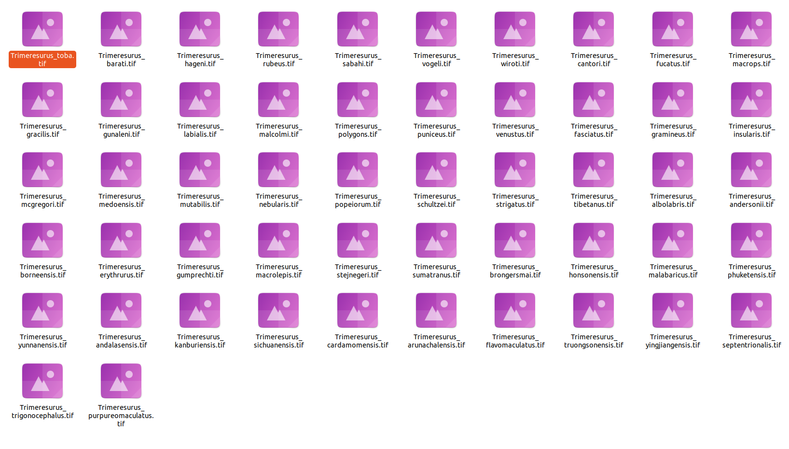

```{r setup, include=FALSE}
knitr::opts_chunk$set(
  collapse = TRUE,
  comment = "#>",
  warning = FALSE,
  message = FALSE
)

ci <- identical(Sys.getenv("CI"), "true")
checking <- nzchar(Sys.getenv("_R_CHECK_PACKAGE_NAME_"))

run_terra <- !(ci || checking)
run_leaflet <- !(ci || checking)
run_heavy <- !(ci || checking)
```

<br> [Omar Daniel Leon-Alvarado](https://leon-alvarado.weebly.com/)¹²; [J. Angel Soto-Centeno](https://www.mormoops.com/)²

¹ Department of Earth and Environmental Science, Rutgers University-Newark, NJ, USA.

² Department of Mammalogy, American Museum of Natural History, New York City, NY, USA. <br>

------------------------------------------------------------------------

Although `vilma` is mainly designed to work with occurrence records, such as those obtained from GBIF, occurrence points are not the only type of spatial information that can be used in biodiversity analyses. For example, if you work with ecological niche models (ENMs), you may already have raster layers representing species suitability or predicted distributions. Although `vilma` includes an option to build ENMs using `vilma.ENM`, you can also use raster outputs generated with other ENM algorithms or external workflows.

To support this type of data, `vilma` includes the function `rat2occ`, which transforms species distribution rasters into occurrence-like coordinates and raster outputs. This allows users to convert raster-based distribution maps into a format compatible with the `vilma` workflow, making the package more flexible for analyses based on point occurrences, species distribution polygons, and raster-based predictions.

### 1. Data

For this exercise, the selected dataset consists of species distribution rasters for the genus *Trimeresurus* (Viperidae). These data can be stored in different raster formats, such as **TIF**, **ASCII**, or **IMG** files. However, once they are read into R, they are usually handled as raster objects, such as `SpatRaster` objects from the `terra` package or `RasterLayer` objects from the `raster` package.

In many cases, each species will be represented by a separate raster file. Because species may have different geographic distributions, these rasters may also differ in their spatial extent. As a result, it may not always be possible to combine them directly into a raster stack without first standardizing their extent, resolution, and alignment. Therefore, before using these data in `vilma`, a simple preparation step is required.

The first step is to identify the directory where the raster files are stored. Then, you will list the files in that directory and select only the files with the `.tif` extension, which is the raster format used in this example.

<br>

</figure>

<figure style="text-align: center; margin: 0 auto;">



<figcaption style="text-align: center; margin-top: 6px; font-size: 0.85em;">

<i><b>Figure 1.</b> Folder with the raster files used in this excercise.</i>

</figcaption>

</figure>

<br>

First, you need to set the working directory where the raster files are stored. Then, use the `dir()` function to list the files in that directory and `grep()` to select only the files with the `.tif` extension. These are the raster files that will be used in the analysis.

Once the `.tif` files have been identified, you can transform the resulting vector into a list using `as.list()`. This step is useful because lists are easier to handle when working with multiple files, especially when the same function needs to be applied to each raster layer.

<br>

```{r, warning=FALSE, message=FALSE, echo=FALSE, eval=FALSE}
library(dplyr)

# Set working directory
setwd("/media/omar/Extreme Pro/Projects/vilma_doc/Trimeresurus/")

# Read the files in the directory
folder_files <- dir()

# Check the files 
head(folder_files, 5L)
```

```         
[1] "Trimeresurus_albolabris.dbf" "Trimeresurus_albolabris.prj" "Trimeresurus_albolabris.shp" "Trimeresurus_albolabris.shx" "Trimeresurus_albolabris.tif"
```

```{r, warning=FALSE, message=FALSE, echo=FALSE, eval=FALSE}


# Get the .shp files only
rast_files <- folder_files[grep(".tif", folder_files)] %>% as.list()

# Check the results
head(rast_files, 5L)
```

```         
[[1]]
[1] "Trimeresurus_albolabris.tif"

[[2]]
[1] "Trimeresurus_andalasensis.tif"

[[3]]
[1] "Trimeresurus_andersonii.tif"

[[4]]
[1] "Trimeresurus_arunachalensis.tif"

[[5]]
[1] "Trimeresurus_barati.tif"
```

<br>

### 2. Read the rasters

This is a simple preparation step. First, each raster file in the list is read using the `rast()` function and stored in a list object. This is done with `lapply()`, which applies the same function to each element of the file list.

Then, the names of the raster objects are defined using the file names. To do this, `gsub()` is used to remove the `.tif` suffix from each element in `rast_files`. These cleaned file names become the species names assigned to each raster in the list. This step is important because `rast2occ()` requires the raster list to have defined names, with each name corresponding to the species represented by that raster.

<br>

```{r, eval=FALSE}

library(terra)

# Read the raster files
list_of_rasters <- lapply(rast_files, function(x){ rast(x) })

# Add the respective names for every file
names(list_of_rasters) <- gsub(".tif","", rast_files)

# Check again
str(list_of_rasters, list.len = 5)
```

```         
List of 52
 $ Trimeresurus_albolabris       :S4 class 'SpatRaster' [package "terra"]
 $ Trimeresurus_andalasensis     :S4 class 'SpatRaster' [package "terra"]
 $ Trimeresurus_andersonii       :S4 class 'SpatRaster' [package "terra"]
 $ Trimeresurus_arunachalensis   :S4 class 'SpatRaster' [package "terra"]
 $ Trimeresurus_barati           :S4 class 'SpatRaster' [package "terra"]
  [list output truncated]
```
<br>

## 3. Transform to Occ

Now, you can transform the raster data into occurrence-like coordinates. The `rast2occ()` function was originally designed to handle the output of `vilma.ENM`, which is stored as a `vilma.ENM` object. Therefore, arguments such as `occ` and `includeSkipped` are specific to that type of object.

In this example, however, you are using your own raster data. Because of this, you only need to provide the raster files as a named list. The function will detect that the input is a list of raster objects and will return a `data.frame` with the standard three-column format used by `vilma`: **Species**, **Longitude**, and **Latitude**.

<br>
```{r, message=FALSE, warning=FALSE, eval=FALSE}
library(vilma)

# Transform the rastes
trimeresurus_rast <- rast2occ(enmRasters = list_of_rasters)

# Check the results
head(trimeresurus_rast, 5L)
```

```{r, message=FALSE, warning=FALSE, eval=run_heavy, echo=FALSE}
invisible(
  capture.output(
    trimeresurus_rast <- rast2occ(enmRasters = list_of_rasters)
  )
)

# Check the results
head(trimeresurus_rast, 5L)
```

<br>

### 4. vilma analysis

Now, you can proceed with the `vilma` workflow. The first step is to create the `vilma.dist` object, which is the basic input object required for all analyses in `vilma`. To create this object, you will use the `points_to_raster()` function and set the raster resolution to 2 degrees.

It is important to note that the resolution of the input rasters does not need to be the same as the resolution used in the final `vilma.dist` object. The input rasters are first transformed into occurrence-like coordinates using `rast2occ()`. Then, `points_to_raster()` creates a new spatial grid for the `vilma` analysis, using the resolution specified by the user. In this example, the analysis grid is created at a resolution of 2 degrees.


<br>
```{r, eval=run_heavy}
library(vilma)

# Create the vilma.dist object
trim_dist <- points_to_raster(points = trimeresurus_rast, res = 2)
```

```{r,fig.align='center', fig.dpi=230, eval=run_leaflet}
#Check the result
view.vilma(trim_dist)
```

<br>

### 4.1. Index calculation

As a final step, once the `vilma.dist` object has been created, you can calculate the phylogenetic diversity index of your choice. In this example, we calculate Faith’s Phylogenetic Diversity using the distribution object generated from the *Trimeresurus* raster data. However, the same workflow can be extended to other alpha-diversity indices, beta-diversity indices, null models, and regionalization analyses available in `vilma`.

Before calculating the index, the phylogenetic tree must be loaded and, if necessary, rooted. Here, the tree is read from the package example data and rooted using midpoint rooting. The tree is then plotted to visually inspect its structure before running the diversity analysis.

<br>

```{r, message=FALSE, warning=FALSE}
library(ape)
library(phytools)
library(ggtree)

# Read the phylogenetic tree
tree_trim <- read.tree("../inst/extdata/Trimeresurus_tree.tre")

# Root the tree using midpoint rooting
tree_trim <- midpoint.root(tree_trim)

# Plot the tree
p <- ggtree(tree_trim) + 
  geom_treescale(width = 15) +
  theme_tree2() +
  geom_tiplab(linewidth = 3)

# Display the plot
print(p)
```

<br>

After checking the tree, the next step is to calculate the index. In this example, `faith.pd()` is used to calculate Faith’s Phylogenetic Diversity for each cell in the `vilma.dist` object. The argument `tree` receives the rooted phylogeny, `dist` receives the spatial distribution object, and `method = "root"` indicates how single-species cells are handled.

<br>

```{r, eval=run_heavy}
# Calculate Faith's Phylogenetic Diversity
trim_pd <- faith.pd( tree = tree_trim, dist = trim_dist, method = "root")
```

<br>

Finally, the resulting `vilma.pd` object can be visualized using `view.vilma()`. This function displays the spatial pattern of the calculated index as an interactive map.

<br>

```{r, fig.align='center', fig.dpi=230, eval=run_leaflet}
view.vilma(trim_pd)
```

<br>
