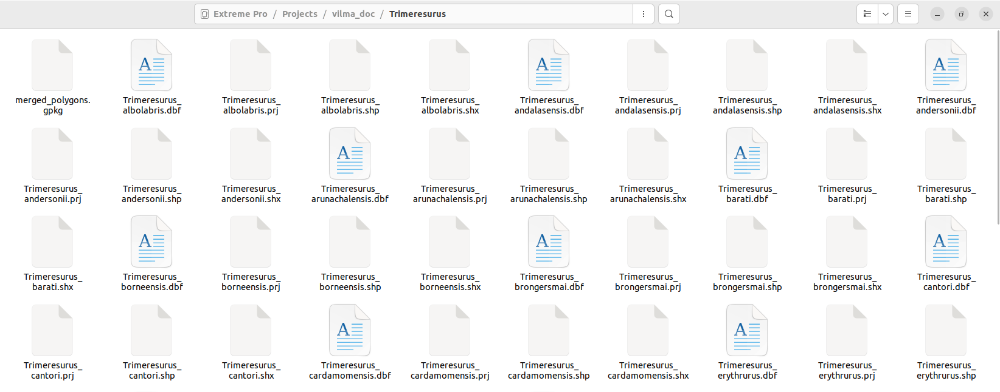

```{r setup, include=FALSE}
knitr::opts_chunk$set(
  collapse = TRUE,
  comment = "#>",
  warning = FALSE,
  message = FALSE
)

ci <- identical(Sys.getenv("CI"), "true")
checking <- nzchar(Sys.getenv("_R_CHECK_PACKAGE_NAME_"))

run_terra <- !(ci || checking)
run_leaflet <- !(ci || checking)
run_heavy <- !(ci || checking)
```

<br> [Omar Daniel Leon-Alvarado](https://leon-alvarado.weebly.com/)¹²; [J. Angel Soto-Centeno](https://www.mormoops.com/)²

¹ Department of Earth and Environmental Science, Rutgers University-Newark, NJ, USA.

² Department of Mammalogy, American Museum of Natural History, New York City, NY, USA. <br>

------------------------------------------------------------------------

Although `vilma` is mainly designed to work with occurrence records, such as those obtained from GBIF, occurrences are not the only type of spatial information that can be used in biodiversity analyses. It is also common to work with polygons that represent species distributions or geographic ranges. For example, one widely used source of distribution polygons is the International Union for Conservation of Nature Red List (IUCN Red List).

To support this type of data, `vilma` includes the function `pol2occ`, which transforms species distribution polygons into occurrence-like coordinates and raster outputs. This allows users to convert polygon-based range maps into a format that can be used in the `vilma` workflow, making the package more flexible for analyses based on both point occurrences and species distribution polygons.

### 1. Data

For this exercise, the selected dataset consists of species distribution polygons for the genus *Trimeresurus* (Viperidae). These data are usually available in shapefile (`.shp`) format, with each species represented by a separate shapefile. It is important to remember that a shapefile is not a single file, but a set of connected files that work together, including extensions such as `.shp`, `.shx`, `.prj`, and `.dbf`. The `.shp` file stores the polygon geometry, while the other files contain spatial reference information, attributes, and indexing information.

The first step is to identify the directory where the polygon files are stored. Then, you will list the files in that directory and select only the files with the `.shp` extension, which contain the polygon geometries needed for the analysis.

<br>

</figure>

<figure style="text-align: center; margin: 0 auto;">



<figcaption style="text-align: center; margin-top: 6px; font-size: 0.85em;">

<i><b>Figure 1.</b> Folder with the polygons files used in this excercise.</i>

</figcaption>

</figure>

<br>

First, you need to set the working directory where all shapefile components are stored. Then, use the `dir` function to list the files in that directory and `grep` to select only the files with the `.shp` extension. These are the files that contain the polygon geometries.

Once the `.shp` files have been identified, you can transform the resulting vector into a list using `as.list`. This step is useful because lists are easier to handle when working with multiple files, especially when you need to apply the same function to each shapefile.

<br>

```{r, warning=FALSE, message=FALSE, echo=FALSE, eval=FALSE}
library(dplyr)

# Set working directory
setwd("/media/omar/Extreme Pro/Projects/vilma_doc/Trimeresurus/")

# Read the files in the directory
folder_files <- dir()

# Check the files 
head(folder_files, 5L)
```

```         
[1] "Trimeresurus_albolabris.dbf" "Trimeresurus_albolabris.prj" "Trimeresurus_albolabris.shp" "Trimeresurus_albolabris.shx" "Trimeresurus_albolabris.tif"
```

```{r, warning=FALSE, message=FALSE, echo=FALSE, eval=FALSE}
# Get the .shp files only
shp_files <- folder_files[grep(".shp", folder_files)] %>% as.list() # Find the .shp and turn it into a list.

# Check again
head(shp_files, 5L)

```

```         
[[1]]
[1] "Trimeresurus_albolabris.shp"

[[2]]
[1] "Trimeresurus_andalasensis.shp"

[[3]]
[1] "Trimeresurus_andersonii.shp"

[[4]]
[1] "Trimeresurus_arunachalensis.shp"

[[5]]
[1] "Trimeresurus_barati.shp"
```

<br>

### 2. Read and merge the polygons

Many polygons files will be MULITPOLYGONS, this means that one SHP file can have more than one polygon or feature, so you need to fix this and treat all polygons as single feature. Here, you will use the function lapply, which is a type of loop. This function will do three different steps: 1) Read the shp file with the function `st_read`, the will merge are polygons into a single feature with `st_union`. 2) You gonna get the name of the species removing the subfix .shp using `gsub`, finally create a `sf` object for every species which will contain the species name and the polygon geometry

<br>

```{r, eval=FALSE}

library(sf)


# Read the polygons
list_of_sf <- lapply(shp_files, function(x){ geom <- st_read(x, quiet = TRUE) %>% st_union() # Step 1
                                             species_name <- gsub(".shp", "", x)             # Step 2
                                             st_sf( species = species_name, geometry = geom) # Step 3
                                            })

# Check the results
str(list_of_sf)
```

```         
List of 52
 $ :Classes ‘sf’ and 'data.frame':  1 obs. of  2 variables:
  ..- attr(*, "sf_column")= chr "geometry"
  ..- attr(*, "agr")= Factor w/ 3 levels "constant","aggregate",..: NA
  .. ..- attr(*, "names")= chr "species"
 $ :Classes ‘sf’ and 'data.frame':  1 obs. of  2 variables:
  ..- attr(*, "sf_column")= chr "geometry"
  ..- attr(*, "agr")= Factor w/ 3 levels "constant","aggregate",..: NA
  .. ..- attr(*, "names")= chr "species"
  [list output truncated]
```

<br>

Now, you have a list of 52 objects of clase `sf` and `data.frame`. This objects are compossed by spatial objects (`sf`) and a data frame with the information of every polygon. In this case the data frame is one row, as we want only one feature by species, and two columns, species and geometry. This type objects are very useful and easy to manage, the are polygons that have a similar logic to the of a data.frame.

Now, you need to combine all species polygons into a single object. To do this, you will use the function `do.call`, which joins all elements of the list into one `sf` object. In this case, the objects are combined using the same column structure: the species name and the geometry column.

At the end of this step, you will have a single object that is both an `sf` object and a `data.frame`, containing all species and their corresponding polygon geometries. You can also save this object in GeoPackage (`.gpkg`) format, which is useful for storing spatial data and reusing it in future analyses.

<br>

```{r, message=FALSE, warning=FALSE, eval=FALSE}

# Combie all polygons into one single object
combined_sf <- do.call(rbind, list_of_sf)

# Check the result
print(combined_sf)
```

```{r, message=FALSE, warning=FALSE, echo=FALSE, eval=FALSE}

# Combie all polygons into one single object
combined_sf <- do.call(rbind, list_of_sf)
combined_sf$species <- gsub("/media/omar/Extreme Pro/Projects/vilma_doc/Trimeresurus/","",combined_sf$species)
# Check the result
print(combined_sf)
```

```         
Simple feature collection with 53 features and 1 field
Geometry type: GEOMETRY
Dimension:     XY
Bounding box:  xmin: -84.72307 ymin: -10.94186 xmax: 127.4907 ymax: 34.26
Geodetic CRS:  WGS 84
First 10 features:
                       species                       geometry
1      Trimeresurus_albolabris MULTIPOLYGON (((112.2433 -8...
2    Trimeresurus_andalasensis MULTIPOLYGON (((100.9539 -1...
3      Trimeresurus_andersonii MULTIPOLYGON (((92.52126 10...
4  Trimeresurus_arunachalensis POLYGON ((92.77333 27.26852...
5          Trimeresurus_barati MULTIPOLYGON (((99.98022 -2...
6      Trimeresurus_borneensis MULTIPOLYGON (((110.0867 1....
7     Trimeresurus_brongersmai MULTIPOLYGON (((98.8953 -0....
8         Trimeresurus_cantori MULTIPOLYGON (((93.39808 8....
9   Trimeresurus_cardamomensis POLYGON ((102.3667 13.27672...
10     Trimeresurus_erythrurus POLYGON ((90.09582 22.4443,...
```

```{r, eval=FALSE}
# Write to GeoPackage
st_write(combined_sf, "Trimeresurus_polygons.gpkg")
```

```{r, echo=FALSE, message=FALSE, warning=FALSE, eval=FALSE}
library(sf)

combined_sf <- read_sf("../inst/extdata/Trimeresurus_polygons.gpkg")
```

<br>

## 3. Transform to Occ

Now that the `combined_sf` object has been created and checked, you can proceed to transform the polygon data into occurrence-like points. To do this, you will use the function `pol2occ`.

The function requires an `sf` object in the argument `pols`. In addition, the argument `sp_id` is mandatory. This argument indicates the name of the column that the function should use to identify the species. In this example, the species column is named `species`.

Using these inputs, `pol2occ` takes the species polygons, converts them into raster layers, and extracts one point for each raster pixel covered by each polygon. Therefore, you also need to define the raster resolution using the argument `res`. The function uses the same resolution labels commonly used by WorldClim and CHELSA, including `"30s"`, `"1m"`, `"2.5m"`, and `"5m"`. By default, `res = "1m"`. The last argument is `return_raster`, which is `TRUE` by default. When this option is enabled, the function returns both the occurrence-like points and the raster layers generated from the polygons.

In this example, you will use a resolution of `"1m"`, equivalent to one arc-minute, and you will keep the raster layers in the output.

```{r, message=FALSE, warning=FALSE, eval=FALSE, eval=FALSE}
library(vilma)

trimeresurus_out <- pol2occ(pols = combined_sf, sp_id = "species", res = "1m", return_raster = TRUE )

str(trimeresurus_out, max.level = 1)
```
```{}
List of 2
 $ occ    :'data.frame':	23142166 obs. of  3 variables:
 $ rasters:List of 245
```

<br>

Now, you can see that the resulting object is a list containing two main elements. The first element is a table with the occurrence-like points for each species, formatted with the columns required by `vilma`. The second element is a list of raster layers generated for each species.

These raster layers can be useful for other types of spatial analyses. Therefore, if you want to save them for later use, you can use the following lines of code.

<br>


```{r, eval=FALSE}
# Extract the species names
r_names <- names(trimeresurus_out$rasters)

# Loop to write every raster
# Files will be save in the working directory

for(i in seq_along(r_names)){
  writeRaster(trimeresurus_out$rasters[[i]], 
              filename = paste0(r_names[[i]], ".tif"), 
              overwrite=TRUE)
}

```

<br>

### 4. vilma analysis

Now, you can proceed with the `vilma` workflow. The first step is to create the `vilma.dist` object, which is the basic input object required for all analyses in `vilma`. To create this object, you will use the `points_to_raster` function and set the raster resolution to 2 degree. Be aware that, from the object generated by `pol2occ`, you only need to use the `data.frame` containing the occurrence-like points.

It is also important to note that the resolution used in `pol2occ` is different from the resolution used to create the `vilma.dist` object. The raster generated by `pol2occ` is used only to extract occurrence-like points from the polygons. In contrast, the raster created by `points_to_raster` defines the spatial grid used for the final phylogenetic diversity analyses in `vilma`.

<br>

```{r, warning=FALSE, message=FALSE, echo=FALSE}
trimeresurus_out <- list(occ = read.csv("../inst/extdata/Trimeresurus_occ.csv"),
                         rasters = NULL)
```

```{r, eval=run_heavy}
library(vilma)

# Create the vilma.dist object
trim_dist <- points_to_raster(points = trimeresurus_out$occ, res = 2)
```

```{r,fig.align='center', fig.dpi=230, eval=run_leaflet}
#Check the result
view.vilma(trim_dist)
```

<br>

### 4.1. Index calculation

As a final step, once the `vilma.dist` object has been created, you can calculate the phylogenetic diversity index of your choice. In this example, we calculate Faith’s Phylogenetic Diversity using the distribution object generated from the *Trimeresurus* polygon data. However, the same workflow can be extended to other alpha-diversity indices, beta-diversity indices, null models, and regionalization analyses available in `vilma`.

Before calculating the index, the phylogenetic tree must be loaded and, if necessary, rooted. Here, the tree is read from the package example data and rooted using midpoint rooting. The tree is then plotted to visually inspect its structure before running the diversity analysis.

<br>

```{r, fig.align='center', fig.width=7, fig.height=7, message=FALSE, warning=FALSE}
library(ape)
library(phytools)

# Read the phylogenetic tree
tree_trim <- read.tree("../inst/extdata/Trimeresurus_tree.tre")

# Root the tree using midpoint rooting
tree_trim <- midpoint.root(tree_trim)

# Plot the tree
plot(tree_trim)
```

<br>

After checking the tree, the next step is to calculate the index. In this example, `faith.pd()` is used to calculate Faith’s Phylogenetic Diversity for each cell in the `vilma.dist` object. The argument `tree` receives the rooted phylogeny, `dist` receives the spatial distribution object, and `method = "root"` indicates how single-species cells are handled.

<br>

```{r, eval=run_heavy}
# Calculate Faith's Phylogenetic Diversity
trim_pd <- faith.pd( tree = tree_trim, dist = trim_dist, method = "root")
```

<br>

Finally, the resulting `vilma.pd` object can be visualized using `view.vilma()`. This function displays the spatial pattern of the calculated index as an interactive map.

<br>

```{r, fig.align='center', fig.dpi=230, eval=run_leaflet}
view.vilma(trim_pd)
```

<br>
