```{r setup, include=FALSE}
knitr::opts_chunk$set(
  collapse = TRUE,
  comment = "#>",
  warning = FALSE,
  message = FALSE
)

ci <- identical(Sys.getenv("CI"), "true")
checking <- nzchar(Sys.getenv("_R_CHECK_PACKAGE_NAME_"))

run_terra <- !(ci || checking)
run_leaflet <- !(ci || checking)
run_heavy <- !(ci || checking)
```

<br>
[Omar Daniel Leon-Alvarado](https://leon-alvarado.weebly.com/)¹²; [J. Angel Soto-Centeno](https://www.mormoops.com/)²

¹ Department of Earth and Environmental Science, Rutgers University-Newark, NJ, USA.

² Department of Mammalogy, American Museum of Natural History, New York City, NY, USA.
<br>

---

### 0. The Shiny App

A **Shiny app** is an interactive web application built in R. It allows users to explore data, run analyses, change parameters, and visualize results without writing code directly in the console. In vilma, the Shiny app provides a graphical interface to access the main functions of the package, making spatial phylogenetic diversity analyses easier for users who prefer an interactive workflow.

### 1. vilma Shiny-app

The `vilma` package includes a Shiny app that provides an interactive interface for running the main analyses available in the package. The app was designed to make spatial phylogenetic diversity analyses more accessible, especially for users who may not be familiar with R coding. Its workflow is organized into a clear, step-by-step structure, guiding users from data preparation to index calculation, visualization, and export of results. This design helps reduce common errors and makes the analytical process easier to follow. To promote reproducibility, the app also records the functions used during each session and allows users to export them as an R script, enabling them to review, repeat, and modify the analysis outside the graphical interface.

#### 1.1. Run the app

Running the Shiny app is simple. First, you need to install the vilma package. At the moment, `vilma` is available through GitHub, so you can install it using the `devtools` package.

<br>

```{r, eval=FALSE}
install.packages("devtools")

devtools::install_github("oleon12/vilma", build_vignettes = FALSE)
```
<br>

Once `vilma` has been installed, you can launch the Shiny app directly from R. To do this, load the package with `library(vilma)` and then run the function `run.vilma.app()`.

```{r, eval=FALSE}
library(vilma)

run.vilma.app()
```

### 2. Welcome page

Once you run this line, the app will open in a web page using your default browser, such as Mozilla Firefox, Brave, or Safari. The first page you see is the **Welcome** page (Fig. 1), which introduces the app's general structure. At the top of the interface, you will find different tabs corresponding to the main steps of the workflow. When you are ready to begin, click the **Continue** button. 

Then, you will proceed to the next page, the **About vilma** page (Fig. 1), which provides a brief introduction to the package. On this page, you will also find a **Continue** button that takes you to the next step in the app.

<br>
<figure style="text-align: center; margin: 0 auto;">
  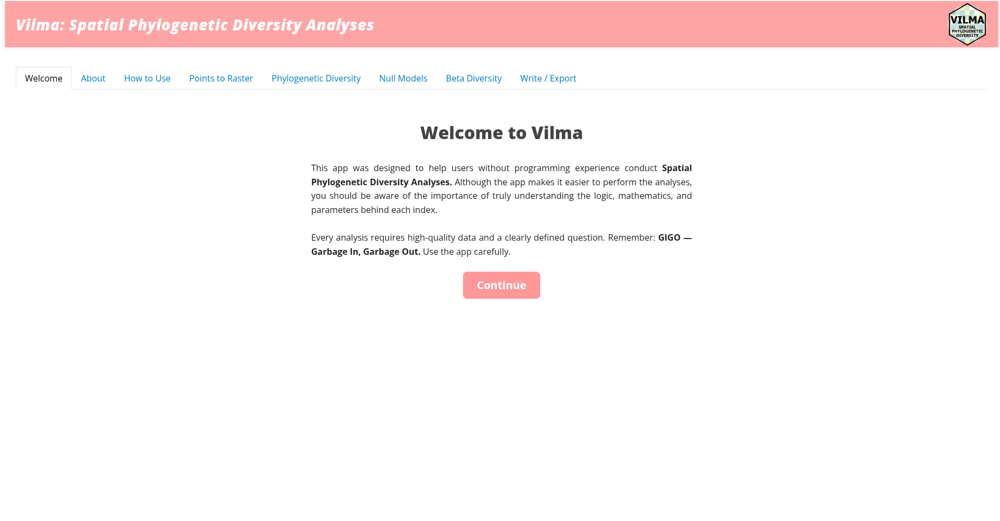
</figure>
<figure style="text-align: center; margin: 0 auto;">
  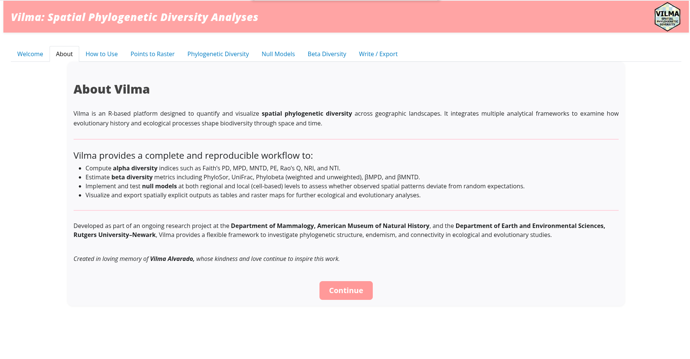
  <figcaption style="text-align: center; margin-top: 6px; font-size: 0.85em;">
    <i><b>Figure 1.</b> Welcome page (top) and About page (bottom) of the vilma Shiny app.</i>
  </figcaption>
</figure>
<br>

### 3. How to use vilma

This is the last introductory page in the app. The **How to Use vilma** page (Fig. 2) provides a brief tutorial introducing the available indices, methods, and structure of the required input files. To continue to the next page, scroll down to the bottom of the page and click the **Continue → points_to_raster** button.

<br>
<figure style="text-align: center; margin: 0 auto;">
  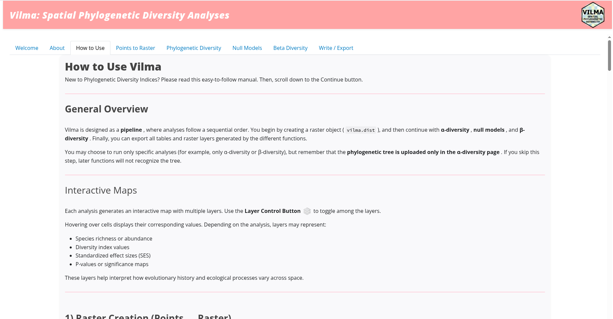
</figure><figure style="text-align: center; margin: 0 auto;">
  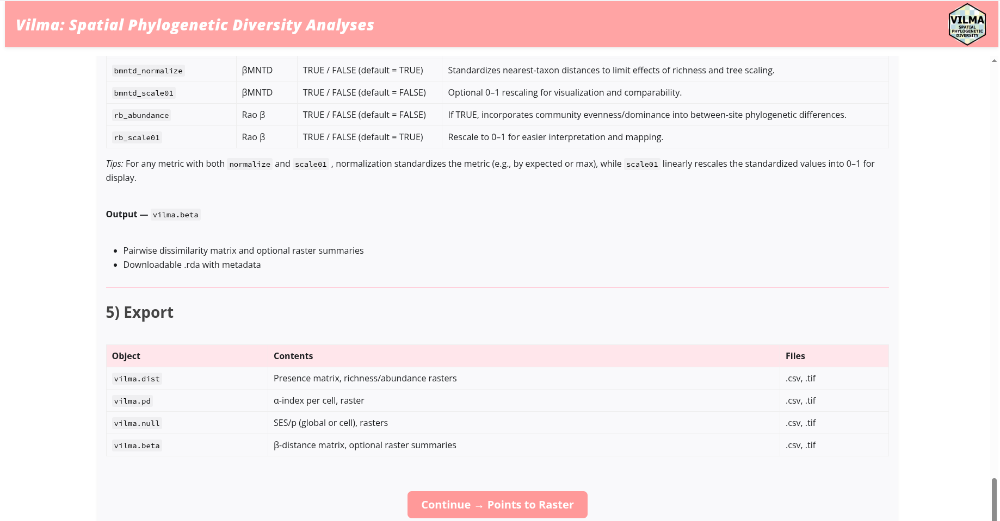
  <figcaption style="text-align: center; margin-top: 6px; font-size: 0.85em;">
    <i><b>Figure 2.</b> Upper section of the How to Use page (top) and lower section of the same page with the Continue button (bottom).</i>
  </figcaption>
</figure>
<br>

### 4. Points to Raster.

This is the first analysis page in the app (Fig. 3), and it represents a basic but essential step in the workflow. On this page, you will create the `vilma.dist` object, which is the main input object used by all index functions in `vilma`.

To start the analysis, upload a comma-separated file containing the three required columns: **Species**, **Longitude**, and **Latitude**. The column names may differ, but the order must follow this structure. To upload the file, click the **Browse** button and select the file from your computer. Then, use the remaining input boxes to define the map projection and the raster pixel resolution. In this example, the resolution is set to 5. Finally, click the **Run analysis** button.

Once the analysis is complete, the resulting raster will be displayed as an interactive map (Fig. 3), together with summary information about the analysis. These outputs are equivalent to using `view.vilma()` and `print()` in R, respectively. When you are good to proceed, just click the button **Next**, and if you wan to save the results, you can click on **Download results (.rda)**.

<br>
<figure style="text-align: center; margin: 0 auto;">
  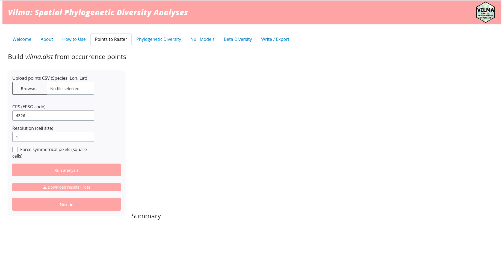
</figure><figure style="text-align: center; margin: 0 auto;">
  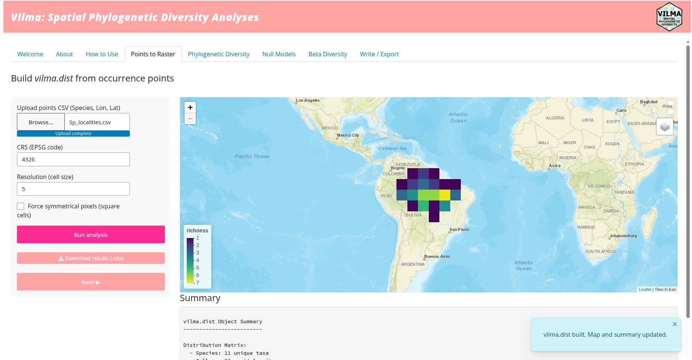
  <figcaption style="text-align: center; margin-top: 6px; font-size: 0.85em;">
    <i><b>Figure 3.</b> Points to Raster page before running the analysis (top) and after running the analysis (bottom). The interactive map and summary output are displayed in the right panel.</i>
  </figcaption>
</figure>
<br>

### 5. Phylogenetic Diversity.

After creating the `vilma.dist` object, the next page is the **Phylogenetic Diversity** page (Fig. 4). On this page, you can calculate one of the alpha phylogenetic diversity indices available in `vilma`.

On the left panel, you will find several input boxes. First, upload the phylogenetic tree by clicking the **Browse** button and selecting the tree file from your computer. Then, use the index selection box to choose the alpha diversity index you want to calculate. In this example, **PE** (**Phylogenetic Endemism**) was selected.

Each time you select an index, the left panel will automatically update to show the specific options and parameters for that index. Once all inputs and parameters are ready, click the **Run analysis** button to start the calculation.

<br>
</figure><figure style="text-align: center; margin: 0 auto;">
  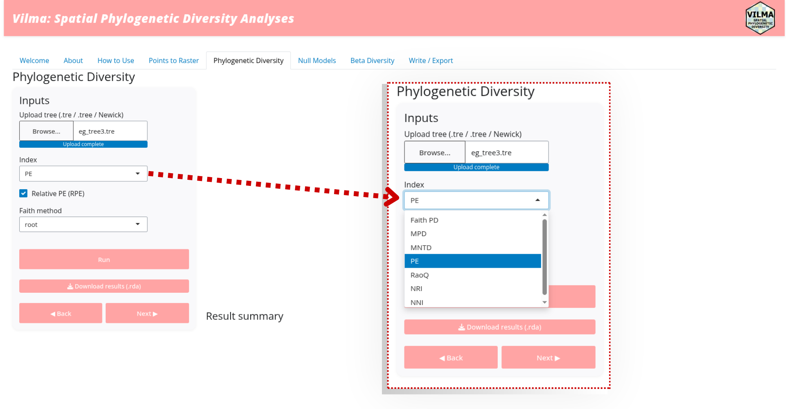
  <figcaption style="text-align: center; margin-top: 6px; font-size: 0.85em;">
    <i><b>Figure 4.</b> Alpha Phylogenetic Diversity page before running the analysis. The close-up shows the panel where users can select one of the indices available in `vilma`.</i>
  </figcaption>
</figure>
<br>

You can see that the output is similar to the previous page, and this structure is used throughout the app. The interactive map and the summary of the results are displayed in the main panel (Fig. 5). If you change any parameter or select a different index, you must click the **Run analysis** button again to update the results.

<br>
</figure><figure style="text-align: center; margin: 0 auto;">
  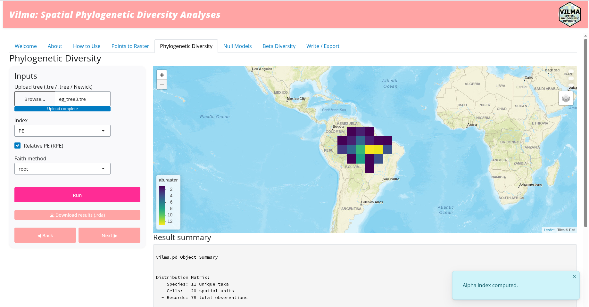
  <figcaption style="text-align: center; margin-top: 6px; font-size: 0.85em;">
    <i><b>Figure 5.</b> Alpha Phylogenetic Diversity page after running the analysis, showing the resulting map and summary output.</i>
  </figcaption>
</figure>
<br>

### 6. Null models

The **Null Model** page (Fig. 6)is the next step after calculating an alpha-PD index. This is a logical step because null models allow you to evaluate whether the observed phylogenetic diversity values in your data differ from random expectations. However, this analysis is optional. If you want to continue without running a null model, you can skip this step by clicking the **Next** button.

In the left panel, you will find the input boxes where you can set the analysis parameters. Please note that the **Index** box is fixed to the index selected on the previous page. Essentially, you can change the number of iterations, the null-model method, either `cell` or `global`, and the sampling method, including `taxa.label`, `range`, `neighbor`, or `regional`. When you select `neighbor` or `regional`, additional input boxes will appear for the specific parameters required by those methods.

Once all required parameters have been selected, click the **Run analysis** button to start the analysis.

<br>
<figure style="text-align: center; margin: 0 auto;">
  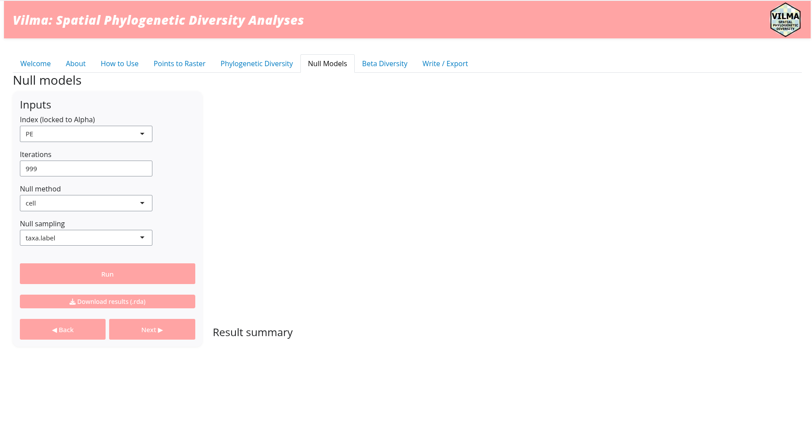
</figure><figure style="text-align: center; margin: 0 auto;">
  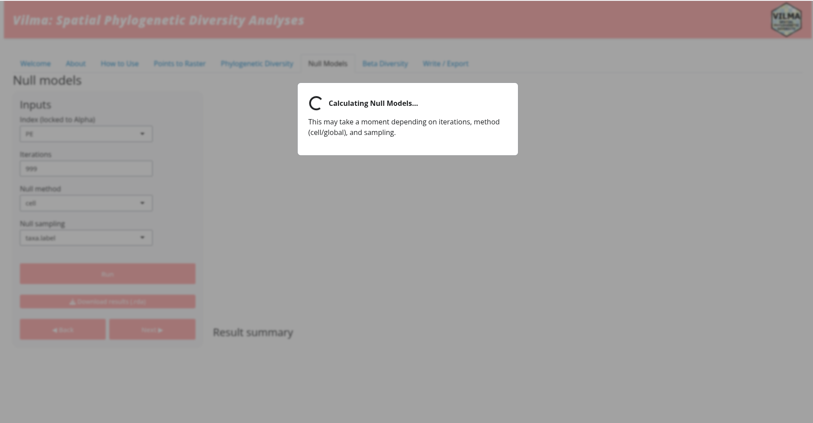
  <figcaption style="text-align: center; margin-top: 6px; font-size: 0.85em;">
    <i><b>Figure 6.</b> Null Model page before running any analysis (top) and the same page showing the waiting message while the index is being calculated (bottom).</i>
  </figcaption>
</figure>
<br>

Once you click the **Run analysis** button, a pop-up message will appear (Fig. 6). This is a waiting message that remains visible while the analysis is running. When the analysis is complete, the app will return to the regular view and display the interactive map together with the summary results (Fig. 7).

Again, if you change any parameter of the null model, you must click the **Run analysis** button again to update the results. If you want to run a null model for a different index, you need to return to the previous page using the **Back** button, select a new alpha-PD index, run that analysis again, and then click **Next** to return to the **Null Model** page.

When you are ready with the null-model analysis, click the **Next** button to continue to the next page.

<br>
</figure><figure style="text-align: center; margin: 0 auto;">
  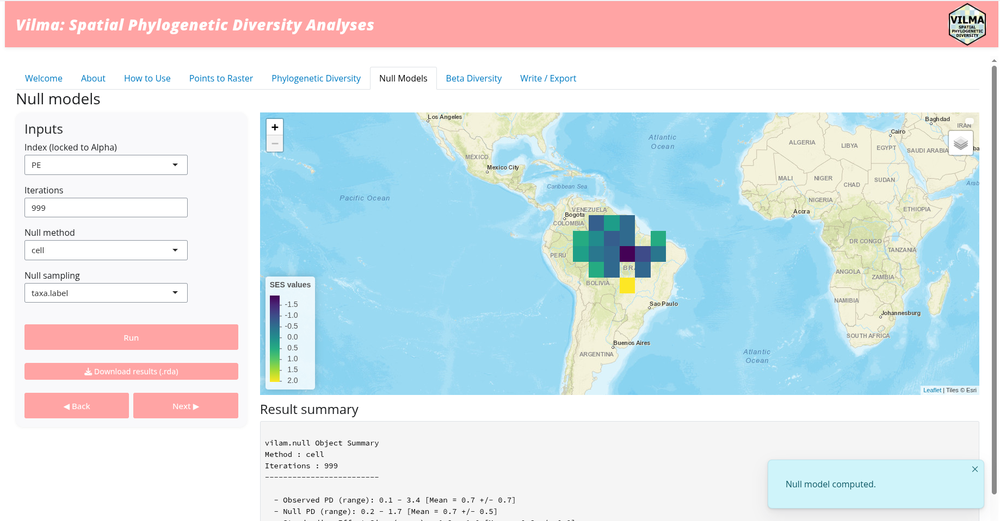
  <figcaption style="text-align: center; margin-top: 6px; font-size: 0.85em;">
    <i><b>Figure 7.</b> Null Model page after the analysis is complete, showing the resulting map and summary output.</i>
  </figcaption>
</figure>
<br>

### 7. Beta Diversity

The **Beta Diversity** page follows a structure similar to the previous analysis pages (Fig. 8). In the left panel, you will find input boxes where you can select a specific beta-PD index and set the parameters required for that index. In this example, the selected index was **UniFrac**.

To start the calculation, click the **Run analysis** button. Once the results are displayed and you are ready to continue, click the **Next** button to move to the next page.


<br>
<figure style="text-align: center; margin: 0 auto;">
  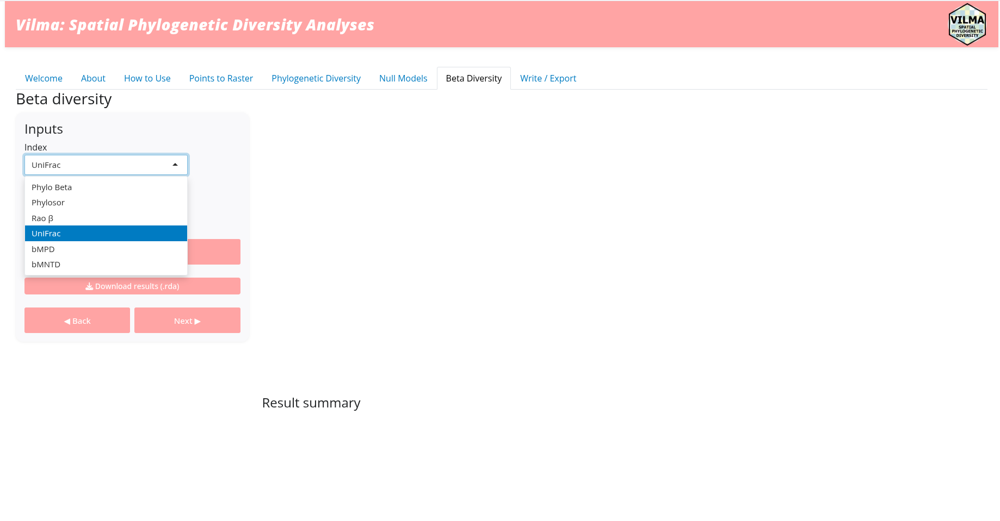
</figure><figure style="text-align: center; margin: 0 auto;">
  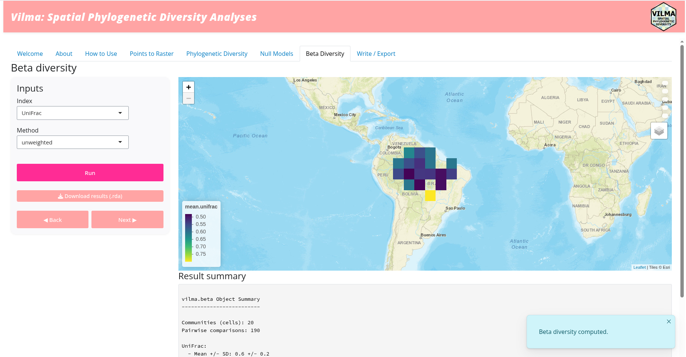
  <figcaption style="text-align: center; margin-top: 6px; font-size: 0.85em;">
    <i><b>Figure 8.</b> Beta Diversity page before running any analysis (top), showing the box where users can select a specific index, and the same page after running the analysis (bottom), showing the resulting maps and summary output.</i>
  </figcaption>
</figure>
<br>


### 8. Write/Export

This is the last page of the app, the **Write/Export** page (Fig. 9). On this page, you can manage and save the information generated during the session. First, set the output path by selecting an existing folder or typing the path to a new one, for example: `/Documents/Work/PD/Results`. Then, click the **Create / Check Folder** button. The app will check whether the folder already exists; if it does not, the app will create it. If everything works correctly, a **Folder ready** message will appear in the lower-left area of the page.

Next, you can select which outputs you want to save. In this example, all available analyses were run, so all output options are available: `dist`, `alpha`, `beta`, and `null`. You can check or uncheck the outputs according to your needs. You can also select the raster format for the exported files. Once the options are ready, click the **Write files to folder** button. A confirmation message will appear when the files have been successfully saved.

Finally, you can export the R code used during the session as an R script. This option makes the workflow reproducible and allows you to share, review, or modify the analysis outside the app. To do this, click the **Export session code (.R)** button. After the confirmation message appears, you can close the app.
. 


<br>
<figure style="text-align: center; margin: 0 auto;">
  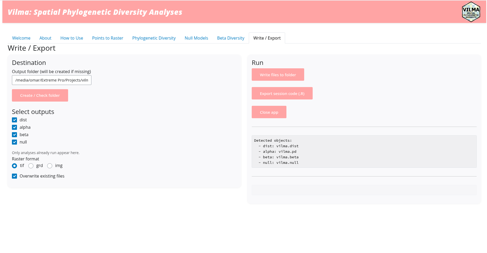
</figure><figure style="text-align: center; margin: 0 auto;">
  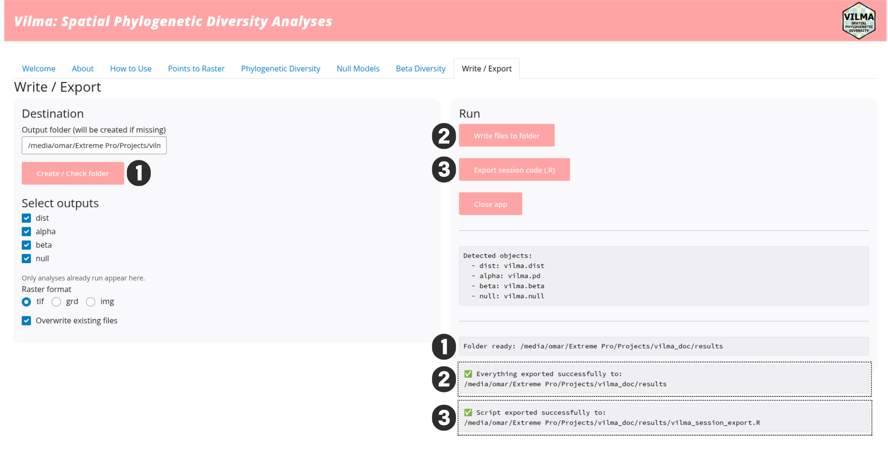
  <figcaption style="text-align: center; margin-top: 6px; font-size: 0.85em;">
    <i><b>Figure 9.</b> Overview of the Write/Export page (top), showing the numbered steps for saving all information generated during the session: 1) create or select the output folder, 2) write files to the folder, and 3) export the session code.</i>
  </figcaption>
</figure>
<br>

Now you can go to the selected folder and check all the files created by the app (Fig. 10). The file names are generic but informative, including labels such as `alpha`, `beta`, or `null`, so you can identify which analysis each file belongs to. In addition, some file names include specific terms such as `nmds` or `unifrac`, indicating the type of output stored in that file.

Because of this saving structure, it is recommended to save the results of different analyses in separate folders. Otherwise, files with similar names may be overwritten by the app.


<br>
</figure><figure style="text-align: center; margin: 0 auto;">
  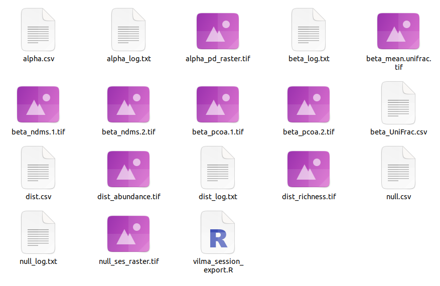
  <figcaption style="text-align: center; margin-top: 6px; font-size: 0.85em;">
    <i><b>Figure 10.</b> Files saved by the app, including raster layers, log files, tables (.csv), and the R script generated from the session.</i>
  </figcaption>
</figure>
<br>

### 9. Final considerations

Now you have learned how to run and use the `vilma` Shiny app. However, there are some important considerations to keep in mind. First, the app is organized as a sequential, step-by-step workflow. However, it is not mandatory to run every analysis. For example, if you only need to calculate **Beta Diversity**, you can skip the other pages by clicking the **Next** button.

Likewise, remember that the `vilma.dist` object is required for every analysis. Therefore, you must always use the **Points to Raster** page and run that analysis first. The phylogeny, which is also required for all phylogenetic indices, is uploaded on the **Phylogenetic Diversity** page. Therefore, even if you only want to calculate beta-diversity indices, you still need to upload the phylogeny on that page before continuing.
